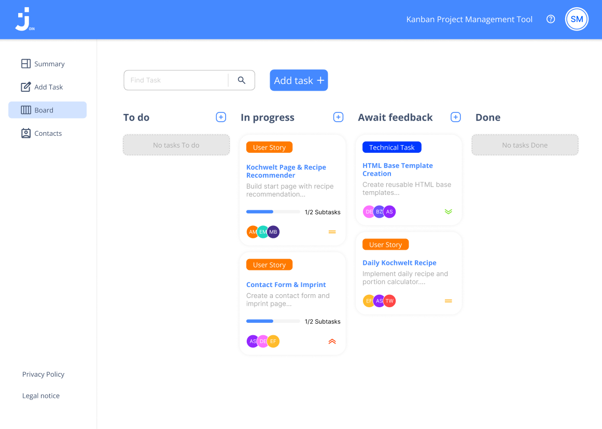

# Project: Join

## Description

As part of our training at the **Developer Academy**, we are developing a web app using **HTML**, **CSS**, **JavaScript**, **Git**, and **Firebase**.  
The goal of this project is to build a **project management tool** that visualizes the status and responsibilities of tasks.

We are using **Join Version 2** as the design template, and an **FTP server** for live demos.

---

## Preview

  

*Example view of the Join web app*

---

## Learning Objectives

- Apply acquired knowledge in **HTML**, **CSS**, and **JavaScript**  
- Gain insight into **professional team collaboration** using **Scrum**  
- Work with modern tools such as **Git** and **Figma**  
- Practice **teamwork** and **version control**

---

## Prerequisites

- Successful completion of **Module 10**  
- Knowledge of **HTML/CSS**, **JavaScript**, and **APIs**

---

## Team

This project was developed by our team of 3 participants:

- Ilker Genc
- Tobias Spiller
- Antonio Marrara

---

## Technical Requirements & Architecture

- **Multi-Page Application (MPA)** structure  
- **Responsive design**: All pages work on **mobile devices** and **desktops**  
- Optimized for **all resolutions starting from 320px**  
- **Content limitation** on large screens (max-width 1440px, left-aligned)  
- In **landscape mode**, a message appears prompting users to change the resolution  
- Custom **form validation** (no HTML5 standard validation)  
- JavaScript functions are documented according to the **JSDoc standard**

---

## Project Guidelines

- All users – including **guest logins** – access the **same boards, contacts, and tasks**  
- At least **5 realistic tasks** and **10 contacts** have been added  
- The app supports **vertical alignment of Kanban columns** on mobile devices

---

## Tools & Technologies

- **HTML5**, **CSS3**, **JavaScript (ES6+)**  
- **Firebase** (for data management and authentication)  
- **Git/GitHub** (version control and collaboration)  
- **Figma** (design template and UI planning)  
- **FTP server** (for live demos)

---

## Links

You can view the live demo [here](https://join-1318.developerakademie.net)  
The design is available on [Figma](https://www.figma.com/file/mhDPfpde734bGDOh5W1U3f/Join-Version-2-final?node-id=0%3A1).